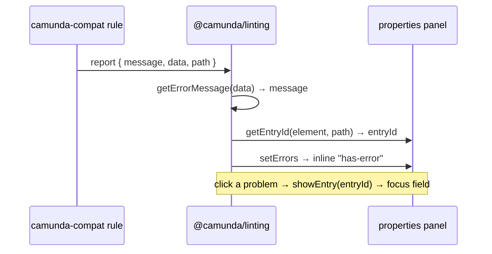

# Linting architecture

How this library composes with `@camunda/linting`, `bpmn-js-properties-panel`,
and `bpmn-js-element-templates` to deliver the in-app "problems" experience.

This is the system view, across repos. For _how to write a rule_ that fits it,
see the [rule authoring guide](./RULE_AUTHORING.md).

## Contents

- [The libraries](#the-libraries)
- [What each library contributes](#what-each-library-contributes)
- [The two contracts](#the-two-contracts)
- [Error flow, end to end](#error-flow-end-to-end)
- [Render-agnostic entry resolution](#render-agnostic-entry-resolution)

## The libraries

In-app linting is **not** one library. It is a composition owned by different
repos: this plug-in only produces findings; the message polish and
properties-panel navigation are added downstream.

```
  bpmnlint-plugin-camunda-compat        bpmn-js-element-templates
  (this repo)                           (bpmn-io)
  ── model-compatibility rules          ── template validation rules
     over the raw BPMN                     over template-bound elements
             │                                        │
             └───────────────┬────────────────────────┘
                             ▼
                     @camunda/linting                (camunda)
                     ── composes both rule sets into one bpmnlint run
                     ── data → message, path → entry (the bridge)
                     ── fires propertiesPanel.setErrors / showEntry
                             │
              ┌──────────────┴──────────────┐
              ▼                             ▼
       Desktop Modeler                 Web Modeler
       (bpmn-js + properties-panel + element-templates)
```

The rendering surface under both modelers is
[`@bpmn-io/properties-panel`](https://github.com/bpmn-io/properties-panel):
each entry reads its own error from a map keyed by _entry id_. Everything above
exists to key the right message to the right entry.

## What each library contributes

### `bpmnlint-plugin-camunda-compat` (this repo)

The **rules**, and only the rules. Each inspects the raw moddle tree and reports
a machine-readable finding — `{ message, data, path }` (see
[rule authoring](./RULE_AUTHORING.md#reporting)). It knows nothing about
modelers, templates, or the panel's DOM: a finding names _what_ (`data`) and
_where_ (a moddle `path`), never how that location is rendered.

### `bpmn-js-element-templates`

Two contributions:

1. **Its own bpmnlint rule set** (`CloudElementTemplatesLinterPlugin`), running
   only on template-bound elements — unknown/missing template, per-property
   constraints, engine-version compatibility, available updates. It is
   **dynamic** (depends on the loaded templates), so the host injects it into
   `@camunda/linting` at runtime as a plugin.
2. **The properties-panel provider** that renders template-bound fields — and
   therefore resolves a moddle `path` to the entry it renders for those fields.

### `bpmn-js-properties-panel`

The **standard** Camunda properties panel and its Zeebe provider. It renders the
standard fields and resolves a moddle `path` to the standard entry that shows it.

### `@camunda/linting`

The **bridge** — the only layer that sees both rule sets, the target
platform/version, and (via the modeler) the panel. It:

- assembles the bpmnlint config (this plug-in's per-version config +
  `bpmnlint:correctness` + injected plugins) and runs **one** pass;
- turns each finding's `data` into a version-aware message (`getErrorMessage`);
- resolves each finding's `path` to a properties-panel entry, then fires
  `propertiesPanel.setErrors` (inline errors) and `showEntry` (click-to-focus).

## The two contracts

A finding travels on two machine-readable contracts, each consumed by a
different layer:

| contract | produced here | consumed by | drives |
| --- | --- | --- | --- |
| `data` (`ERROR_TYPES` + fields) | every finding | `@camunda/linting` | the version-aware **message** |
| `path` / `paths` (moddle location) | every property-level finding | the properties panel | the **entry** to highlight / focus |

Both are stable: `data.type` is treated as public API, and `path` is a plain
[`@bpmn-io/moddle-utils`](https://github.com/bpmn-io/moddle-utils) location.
Splitting message from navigation is what lets a rule stay render-agnostic.

## Error flow, end to end



The element-templates validate rule joins at the same report step and flows
through the identical bridge.

## Render-agnostic entry resolution

The same finding must open the **standard** field on a plain element and the
**element-template** field when a template is applied — with no rule change.
That is why a rule emits a moddle `path`, not an entry id: only the render layer
knows which entry renders a given location, and whether a template has replaced
it.

Resolution therefore lives in the properties panel, contributed per provider
(mirroring how providers contribute `getGroups`). Given a report's `path`,
`@camunda/linting` asks the panel — `propertiesPanel.getEntryId(element, path)` —
and never reconstructs an entry id itself:

- The **element-templates** provider answers first: when the element is
  template-bound it maps `path → binding → its template entry`; otherwise it
  defers.
- The **standard** provider answers for every field it renders: `path → entry`.

A finding that legitimately spans several fields (e.g. duplicate keys) carries a
plural `paths` — one moddle location per field — and each resolves the same way.

> The render-agnostic resolution described here is being rolled out across the
> panel and linting repos under
> [internal-docs#1355](https://github.com/bpmn-io/internal-docs/issues/1355).
